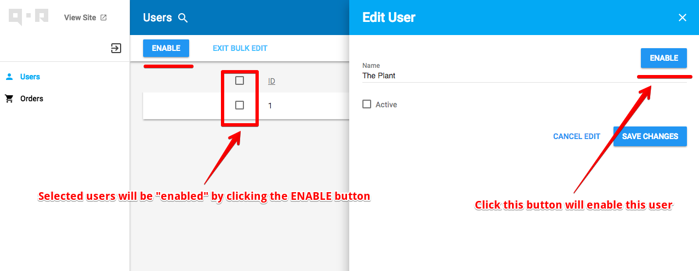

# Action

[Action](https://github.com/qor/admin/blob/master/action.go) provides a way to make shortcut functions based on [QOR Admin](/admin/README.md) UI.

## Usage

Let's define an `Enable` action on a user to see how `Action` works.

```go
type User struct {
  gorm.Model
  Name   string
  Active bool
}

user := Admin.AddResource(&models.User{})

user.Action(&admin.Action{
  Name: "enable",
  Handle: func(actionArgument *admin.ActionArgument) error {
    // `FindSelectedRecords` => in bulk action mode, will return all checked records, in other mode, will return current record
    for _, record := range actionArgument.FindSelectedRecords() {
      actionArgument.Context.DB.Model(record.(*models.User)).Update("Active", true)
    }
    return nil
  },
})
```

Then user's `index` and `edit` page will show a button "ENABLE" like this:



## Configurations

```go
type Action struct {
    Name        string
    Label       string
    Method      string
    URL         func(record interface{}, context *Context) string
    URLOpenType string
    Visible     func(record interface{}, context *Context) bool
    Handler     func(argument *ActionArgument) error
    Modes       []string
    Resource    *Resource
    Permission  *roles.Permission
}
```

* Name

  The name of the action. This will be the button text if no `Label` option passed in

* Label

  The button text of the action

* Method

  HTTP method, the default is `PUT`. When there is `URL` option, it will be `GET` by default

* URL

  Set the URL that the action button shall trigger requests. This option will overwrite the `Handler` option. Check [Action by URL](#url-action) for example.

* URLOpenType

  Set how to open the URL, The default value for the action that has `Resource` is `bottomsheet`(the link will be opened in a popup window). For the action that has no `Resource` is `_blank`.

* Visible

  Set the condition of when this action is visible, check [Visible Actions based on a condition](#visible-actions-based-on-a-condition) for example.

* Handler

 The function to process the request from action, it's type is `func(argument *ActionArgument) error`

 The `ActionArgument` used in `Handler` option has 3 attributes.

    * `PrimaryValues`, `[]string`. This records the object ID(s).
    * `Context`, `*admin.Context`. The context of [QOR Admin](/admin/README.md). Check Admin context for more detail.
    * `Argument`, `interface{}`. The argument of user input. check [Action with user input](#action-with-user-input) for example.

  Also, has a function `FindSelectedRecords`, it returns checked records in bulk action mode, return current record in other modes.

* Permission

  Permission control, check out [Authentication](/admin/authentication.md#authorization-for-actions) for details.

*  Resource

  Set resource to store user input. Check [Action with user input](#action-with-user-input) for example.

* <a id="action-modes"></a>Modes

  Support 5 options: `"batch", "edit", "show", "menu_item"`, `collection`, the 5 `Modes` mapping to these pages:

  * `batch`, bulk actions, will be shown in index listing page when enable `Bulk Edit` mode
  * `collection`, will be shown in the index listing page
  * `show`, Show page action, will be shown in show page.
  * `edit`, Edit form action, will be shown on the edit page.
  * `menu_item`, Menu item action, will be shown in table's menu.

## Visible Actions based on a condition

  Use `Visible` to display `Cancel` order action when an order's in "draft" and "processing" state only, the `record` parameter of `Visible` option is the current order. We can determine order state by it. When the return value is false, this action is invisible to the user.

  ```go
  order.Action(&admin.Action{
    Name: "Cancel",
    Handler: func(argument *admin.ActionArgument) error {
      // cancel the order
    },
    Visible: func(record interface{}, context *Context) bool {
      if order, ok := record.(*models.Order); ok {
        for _, state := range []string{"draft", "processing"} {
          if order.State == state {
            return true
          }
        }
      }
      return false
    },
    Modes: []string{"show", "menu_item"},
  })
  ```

## URL Action

This example shows how to make an action that user could click it to view product detail page at the front-end. The `record` parameter of `URL` function is the current product, we make the URL to front-end by the product's code.

```go
  product.Action(&admin.Action{
    Name: "View On Site",
    URL: func(record interface{}, context *admin.Context) string {
      if product, ok := record.(*models.Product); ok {
        return fmt.Sprintf("/products/%v", product.Code)
      }
      return "#"
    },
    Modes: []string{"menu_item", "edit", "show"},
  })
```

## Batch Action

  Create a batch action with QOR Admin is fairly easy, just use [Action Modes](#action-modes) to enable an action on the index page, the action becomes batch actions then, for example:

  ```go
  order.Action(&admin.Action{
    Name: "Cancel",
    Handler: func(argument *admin.ActionArgument) error {
      // cancel the order
    },
    Visible: func(record interface{}, context *Context) bool {
      if order, ok := record.(*models.Order); ok {
        for _, state := range []string{"draft", "processing"} {
          if order.State == state {
            return true
          }
        }
      }
      return false
    },
    Modes: []string{"batch"},
  })
  ```

## Action with user input

You need to define a resource to accept user's input, which could be used in the `Handler` function.

```go
// the ship action's argument
type trackingNumberArgument struct {
  TrackingNumber string
}

trackingNumberRes := Admin.NewResource(&trackingNumberArgument{})

order.Action(&admin.Action{
  Name: "Ship",
  Handler: func(argument *admin.ActionArgument) error {
    // Get the user input from argument.
    trackingNumberArgument := argument.Argument.(*trackingNumberArgument)
    for _, record := range argument.FindSelectedRecords() {
      argument.Context.GetDB().Model(record).UpdateColumn("tracking_number", trackingNumberArgument.TrackingNumber)
    }
    return nil
  },
  Resource: trackingNumberRes,
  Modes: []string{"show", "menu_item"},
})
```
