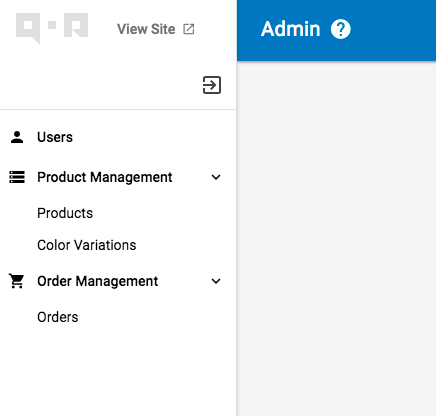
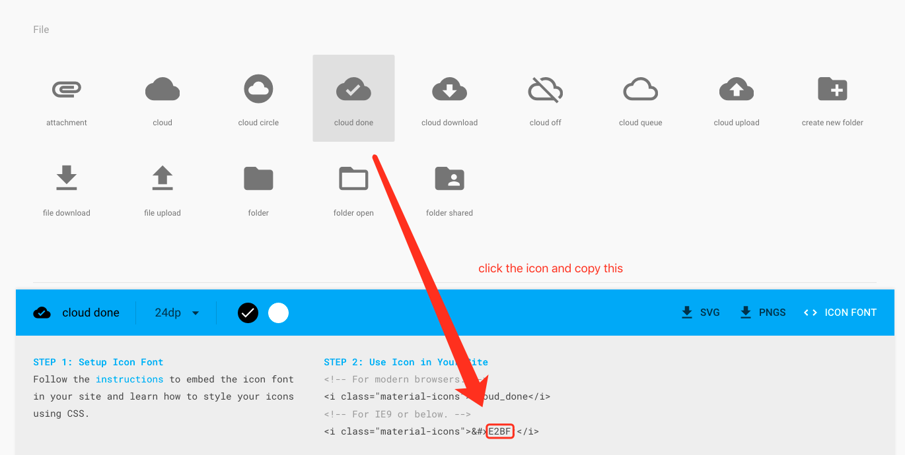

# Menus

[QOR Admin](../chapter2/setup.md) provides flexible way to manage menus. By default, `Resource` will be listed at the top level of menu. You can set the position manually.

```go
Admin.AddResource(&User{})

Admin.AddResource(&Product{}, &admin.Config{Menu: []string{"Product Management"}})
Admin.AddResource(&Color{}, &admin.Config{Menu: []string{"Product Management"}})
Admin.AddResource(&Size{}, &admin.Config{Menu: []string{"Product Management"}})

Admin.AddResource(&Order{}, &admin.Config{Menu: []string{"Order Management"}})
```

This will generate menus like this:



If you don't want a resource to be displayed in the menu, pass the `Invisible` option:

```go
Admin.AddResource(&User{}, &admin.Config{Invisible: true})
```

### Register a menu with custom URL

You can add menu with custom URL, like this

```go
Admin.AddMenu(&admin.Menu{Name: "Dashboard", Link: "/admin"})

// Register nested menu, The "menu" under "Dashboard"
Admin.AddMenu(&admin.Menu{Name: "menu", Link: "/link", Ancestors: []string{"Dashboard"}})

// Register menu with permission, User has "admin" permission could access "Report" page.
Admin.AddMenu(&admin.Menu{Name: "Report", Link: "/admin", Permission: roles.Allow(roles.Read, "admin")})
```

Please check [Roles](../plugins/roles.md) for more permission control informations.

### Configure your own menu icon

[QOR Admin](../chapter2/setup.md) uses icons from [material icons](https://material.io/icons/), and pre-generated attribute name on each menu. So it is very easy to customize your own menu icon.

Assume you are adding icon to `Product`. First, go to [material icons](https://material.io/icons/) page and pick the icon you wanted then copy the content in the screenshot



Then put it in the css, about how to customize css for [QOR Admin](../chapter2/setup.md) go check [QOR Admin theme](../chapter2/theme.md).

```css
[qor-icon-name*="Products"] > a::before {
  content: "\E2BF";
}
```

Go to [QOR Admin](../chapter2/setup.md), you should see the icon has been displayed beside the product menu.
