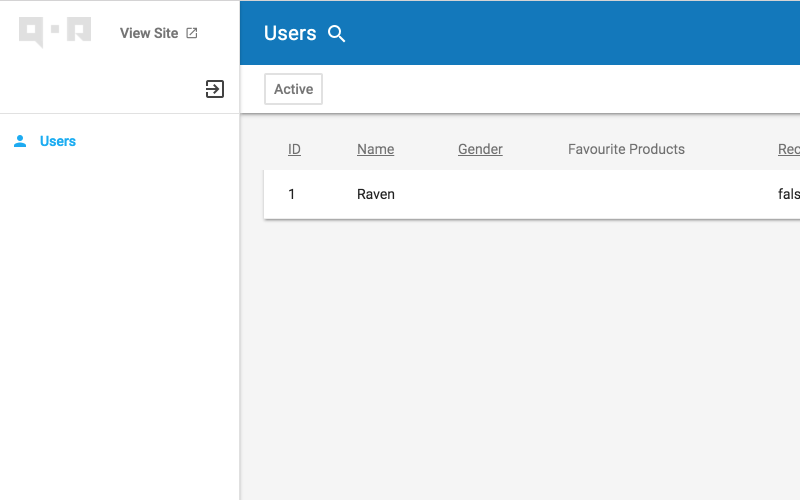
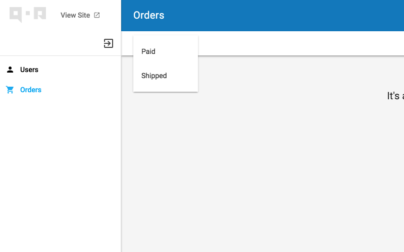

# Search & Scopes & Filters

## Search

You could configure searchable attributes for a resource with `SearchAttrs`, if `SearchAttrs` is not set, will use resource's `IndexAttrs` to search

```go
// Allow search products with its Name, Code and its category, brand's Name
product.SearchAttrs("Name", "Code", "Category.Name", "Brand.Name")
```

After SearchAttrs is set, QOR Admin will generate a `SearchHandler` func for current resource based on your configuration, e.g:

```go
product.SearchHandler
```

You can overwrite it to customize resource's search, like preload some relations to kill `N+1` issue

```go
oldSearchHandler := product.SearchHandler
product.SearchHandler = func(keyword string, context *qor.Context) *gorm.DB {
	context.SetDB(context.GetDB().Preload("Variations.Color").Preload("Variations.Size").Preload("Variations.Material"))
	return oldSearchHandler(keyword, context)
}
```

### Add Resource to Admin Search Center

QOR Admin provides a search center, you could register searchable resources with `AddSearchResource`, with the search center, you could search multiple resources in one request

```go
Admin.AddSearchResource(product, user, order)
```

## Scopes

You can define scopes to filter data with given conditions, for example:

```go
// Only show active users
user.Scope(&admin.Scope{Name: "Active", Handler: func(db *gorm.DB, context *qor.Context) *gorm.DB {
  return db.Where("active = ?", true)
}})
```

Screenshot



### Group Scopes

To put similar scopes into one group, set the `Group` name for it as below:

```go
order.Scope(&admin.Scope{Name: "Paid", Group: "State", Handler: func(db *gorm.DB, context *qor.Context) *gorm.DB {
    return db.Where("state = ?", "paid")
}})

order.Scope(&admin.Scope{Name: "Shipped", Group: "State", Handler: func(db *gorm.DB, context *qor.Context) *gorm.DB {
  return db.Where("state = ?", "shipped")
}})
```

Screenshot:



### Default Scopes

  Default Scope will be applied to all requests

  ```go
  order.Scope(&admin.Scope{
    Name: "Default Scope",
    Default: true,
    Handler: func(db *gorm.DB, context *qor.Context) *gorm.DB {
      return db.Where("state = ?", "paid")
    },
  })
  ```

### Visible Scopes based on a condition

Make scope visible based on `Visible` return `true`

```go
order.Scope(&admin.Scope{Name: "Paid", Group: "State",
  Visible: func(context *admin.Context) bool {
    return context.CurrentUser.IsAdmin
  },
  Handler: func(db *gorm.DB, context *qor.Context) *gorm.DB {
      return db.Where("state = ?", "paid")
  },
})
```

[Scopes Online Demo](http://demo.getqor.com/admin/products)

## Filters

Make any [Resource](/admin/resources.md) filter-able, within [QOR Admin](/admin/README.md), with given setting(s).

The example below shows how to filter Users, in a hypothetical project, by gender (either 'Male', 'Female', or 'Unknown').

```go
// Filter users by gender
user.Filter(&admin.Filter{
  Name: "Gender",
  Config: &admin.SelectOneConfig{
    Collection: []string{"Male", "Female", "Unknown"},
  },
})

// Filter products by collection
product.Filter(&admin.Filter{
	Name:   "Collections",
	Config: &admin.SelectOneConfig{RemoteDataResource: collection},
})
```

Screenshot:


### Visible Filters based on a condition

Make Filter visible based on `Visible` return `true`

```go
user.Filter(&admin.Filter{
  Name: "Gender",
  Visible: func(context *admin.Context) bool {
    return context.CurrentUser.IsAdmin
  },
  Config: &admin.SelectOneConfig{
    Collection: []string{"Male", "Female", "Unknown"},
  },
})
```
