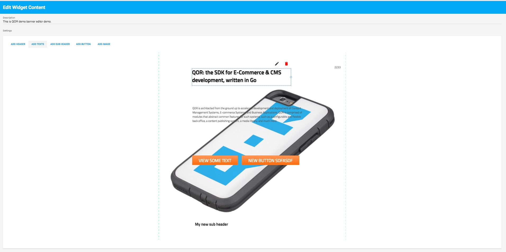

# BannerEditor

A visual editor to design a banner with customize elements, e.g. Text, Button, etc. You could drag element and edit element attributes (font, color and more).

Screenshot:



# How to configure meta as banner_editor

```go
    // Main resource that will has a banner_editor meta
    type HomePage struct {
        BannerHTML string
    }

	// Define element's attributes
	type buttonSetting struct {
		Text  string
		Link  string
		Color string
	}

	type subHeaderSetting struct {
		Text  string
		Color string
	}

	buttonRes := Admin.NewResource(&buttonSetting{})
	buttonRes.Meta(&admin.Meta{Name: "Text"})
	buttonRes.Meta(&admin.Meta{Name: "Link"})

	subHeaderRes := Admin.NewResource(&subHeaderSetting{})
	subHeaderRes.Meta(&admin.Meta{Name: "Text"})
	subHeaderRes.Meta(&admin.Meta{Name: "Color"})

    // Important: configure element's template path
	banner_editor.RegisterViewPath("github.com/qor/banner_editor/test/views")

	banner_editor.RegisterElement(&banner_editor.Element{
		Name:     "Button",
		Template: "button", // Looking: https://github.com/qor/banner_editor/blob/master/test/views/button.tmpl
		Resource: buttonRes,
		Context: func(c *admin.Context, r interface{}) interface{} {
			setting := r.(QorBannerEditorSettingInterface).GetSerializableArgument(r.(QorBannerEditorSettingInterface)).(*buttonSetting)
			return setting
		},
	})

	homePageResource := Admin.AddResource(&HomePage{})
	homePageResource.Meta(&admin.Meta{Name: "BannerHTML", Config: &banner_editor.BannerEditorConfig{}})
```

# How to specified elements in banner_editor's toolbar

```go
	homePageResource.Meta(&admin.Meta{Name: "BannerHTML", Config: &banner_editor.BannerEditorConfig{
		Elements: []string{"Button"}, // elements you would like to display
    }})
```
