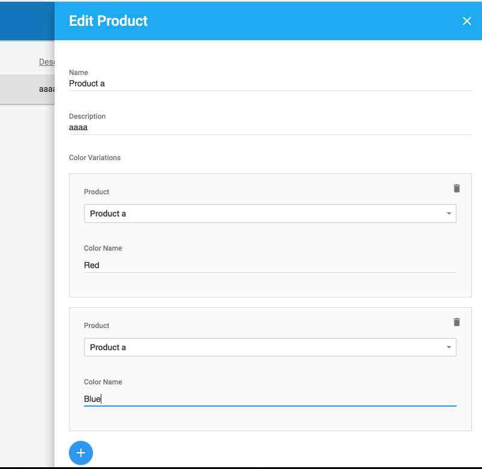

# Collection/Single edit

## Collection

*Collection edit* is generated by `has many` associations automatically. For example, a hypothetical project's 'Product' that has many ColorVariations may be setup as follows:

```
type Product struct {
  gorm.Model
  Name            string
  Description     string
  ColorVariations []ColorVariation
}

type ColorVariation struct {
  gorm.Model
  ProductID uint
  Product   Product
  ColorName string
}
```

...QOR will generate a sub-form inside the 'Product' section of [QOR Admin](../chapter2/setup.md), it is displayed in a slide-out sheet[1]:



## Single

*Single edit* is generated by `has one` associations automatically. For example, a hypothetical project's 'Product' that has one ParameterIntro may be setup as follows:

```
type Product struct {
  gorm.Model
  Name           string
  Description    string
  ParameterIntro Parameter
}

type Parameter struct {
  Height int
  Weight int
}
```

...and QOR will generate a sub-form inside the 'Product' section of [QOR Admin](../chapter2/setup.md), again in a slide-out sheet[1].


## Customize field inside nested form

Continue use single edit example, You can customize attribute of Parameter resource by:

```
product := Admin.AddResource(&Product{})
parameter := product.Meta(&admin.Meta{Name: "Parameter"}).Resource
parameter.Meta(&admin.Meta{Name: "Height", Type: "Float"})
```

[1] note: slide-out sheet is not an official [Material Design](https://material.google.com) element, but we think it really helps maintain context when editing!